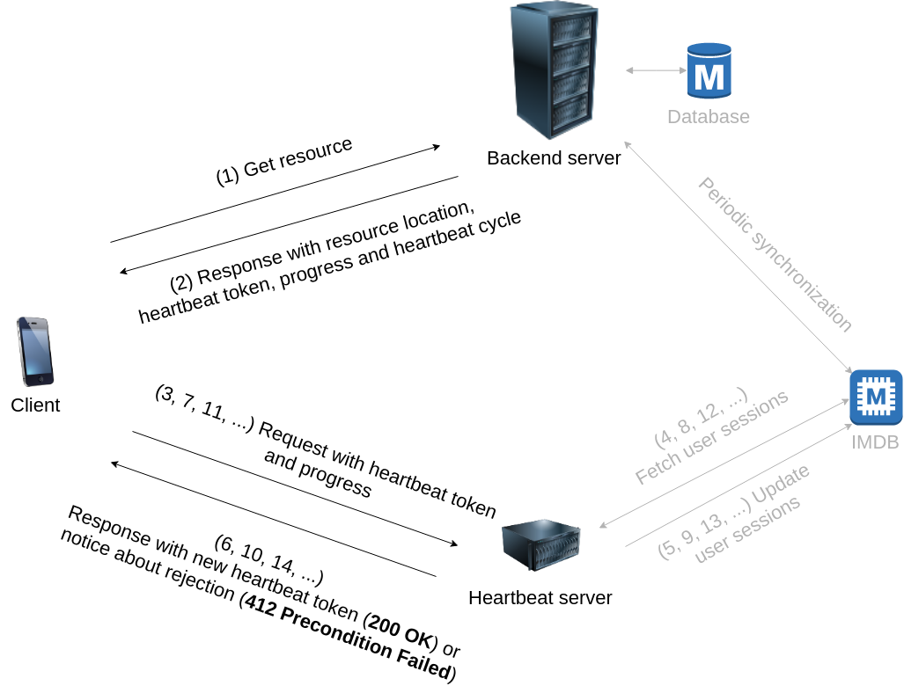

# Heartbeat Server

[](https://travis-ci.com/Ingemark/heartbeat-server)

--- 

Component used for OTT applications to limit the number of parallel streaming
sessions per registered user, remember the progress where user stopped last time and
provide data to analyze detailed play history.

## Development
### Requirements

- `nodejs`, version **8.10.0**+
  - install via `nvm` (recommended) or any other source
- `redis` server, tested with version **3.0.6** (for now, the only supported
in-memory storage)

### Configuration

- create `.env` file in root directory
    - `.env.example` file is an example of configuration `.env` file
    - `PORT`, `SHARED_KEY` and `STORAGE` are required, while others are optional
```
# get dependencies
npm install
```

### Running the server

```bash
# start the system for development
npm start

# start the system for production
npm run startProd
```

## Testing

```bash
# run unit tests with mocha
npm test
```

```bash
# run integration tests
npm run integrationTest; PASSED=$?
echo $PASSED # 0 - success, 1 - fail
```

## Deployment

Clone repository to machine where system will be deployed. Create and configure `.env`
file. 

Install next dependencies:

- `docker` ([official instructions](https://docs.docker.com/install/))
- `docker-compose` ([official instructions](https://docs.docker.com/compose/install/))

```bash
# build (rebuild) and start heartbeat server
docker-compose up --build
```

Heartbeat server will be ready on port specified in `PORT` variable inside `.env` file.

### Simple standalone docker deployment with remote _redis_
```bash
docker build -t heartbeat_server .   
docker run -d -e STORAGE=redis -e REDIS_URL='redis://192.168.18.95:4545' -e SHARED_KEY=asdfasdf -p 5555:3000 heartbeat_server:latest
```

## Specification of other components

Heartbeat server needs configured clients and backend server to work properly. 



### Client specification

The process starts with requesting resource URL from backend. On client's request with resource id, user authentication token and
other necessary data, backend responds with: `heartbeat_token`, `heartbeat_cycle` and `progress`.

Client saves `heartbeat_token` in local storage and begins to reproduce the resource at position defined 
by `progress` variable (which describes the time elapsed from beginning of the resource). In the same moment, 
client sets periodic timer with period of time defined in `heartbeat_cycle` variable. Periodic timer is active 
during entire player session. 

Every time when timer expires, client sends request to heartbeat server.

```
POST https://path.to.heartbeat.server/

Headers:
    Content-Type: "application/json"

Request body:
{
  "heartbeat_token": "U2FsdGVkX1...", // last received heartbeat_token
  "progress": 42                      // current progress of playing content
}
```

Path to heartbeat server has to be hardcoded into client application. `heartbeat_token` represents the last received
token from heartbeat server or backend that is located in local storage. `progress` stands for number of seconds
elapsed from beginning of playing content in the moment of sending the heartbeat.

Heartbeat server responds in two different ways; positive and negative

#### Positive response

When response is positive, it means that client receives new `heartbeat_token` and continues to reproduce current
content. Newly received `heartbeat_token` has to be saved in local storage and be used for next heartbeat request.

```
Status: 200 OK
Response body:
{
    "heartbeat_token": "VkX1844Ibx..." // new heartbeat token
}
```

#### Negative response

When response is negative, it means that client has to stop reproducing the content and inform user about reasons.
The negative response contains appropriate message to the user. The message always remains the same, so client
application can rely on HTTP status code (412 Precondition Failed).

```
Status: 412 Precondition Failed
Response body:
{
  "error": "Your session limit has been exceeded."
}
```

Another negative response occurs when `heartbeat_token` cannot be parsed by heartbeat server which 
responds with HTTP status code (406 Not Acceptable).

```
Status: 406 Not Acceptable
Response body:
{
  "error": "Heartbeat token is not valid."
}
```

### Backend specification

Client sends request to backend in order to get resource URL of playable content. Backend then forms `heartbeat_data`.

```
heartbeat_data = {
    "user_id": 13, // int
    "asset_id": 14, // int
    "heartbeat_cycle": 3, // decimal
    "reject_strategy": "LEAST_RECENT", // string
    "cycle_lower_tolerance": 0.3, // decimal
    "cycle_upper_tolerance": 0.8, // decimal
    "timestamp": "2018-06-05T16:16:14.418Z", // string
    "session_limit": 1, // int
    "checking_threshold": 3, // int
    "sessions_edge": 10 // int
}
```

`heartbeat_data` consists of:

* `user_id` - represents user identifier in database.
* `asset_id` - playable resource identifier in database.
* `heartbeat_cycle` - number of seconds which represents a period of sending heartbeat requests
* `reject_strategy` - strategy for rejecting users. supported strategies: ['LEAST_RECENT', 'MOST_RECENT']
* `cycle_lower_tolerance` - number of seconds which represents time tolerance on receiving heartbeat request before time set in `heartbeat_cycle`.
* `cycle_upper_tolerance` - number of seconds which represents time tolerance on receiving heartbeat request after time set in `heartbeat_cycle`.
* `timestamp` - time of sending heartbeat in ISO 8601 format (Combined date and time representation).
* `session_limit` - number of allowed parallel active sessions for particular user.
* `checking_threshold` - number of heartbeats in current session after which the system starts to check active 
session limit. used for tracking only real active sessions and ignoring ones that have only been started.
* `sessions_edge` - maximum number of active sessions that can persist in local in-memory database. 
used for preventing cache overfill while spamming heartbeat requests.

After forming `heartbeat_data`, it has to be encrypted into `heartbeat_token` 
with the same key that heartbeat server uses for encrypting `heartbeat_data`.

## Encryption process

* Algorithm: AES 256 CBC
* IV - random generated 16 bytes (32 bytes when converted to hex)
* Salt - random generated 16 bytes (32 bytes when converted to hex)
* Key derivation function (used to generate key from passphrase) - PBKDF2
  * Iterations: 3
  * Hashing algorithm: SHA1
  * Key size: 32 bytes
* Encrypted data is being encoded in Base64 

After data is encrypted, the `heartbeat_token` is created by concatenating
 Salt (16 bytes converted in hex - 32 bytes), IV (16 bytes converted in hex - 32 bytes)
 and AES-256-CBC encrypted data encoded with base64. Format is shown below:

"[Salt (0-31 bytes)] | [IV (32-63 bytes)] | [Encrypted data (64> bytes)]"
